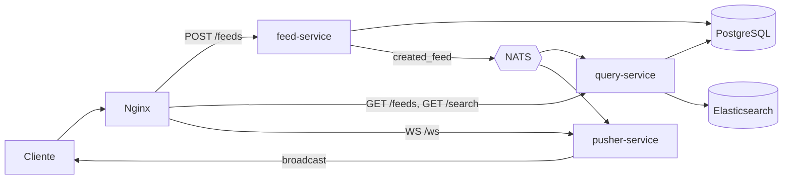

# go-events-cqrs

Feed de publicaciones construido con **CQRS** y **arquitectura orientada a eventos** en Go. Las escrituras, las lecturas y las notificaciones en tiempo real viven en microservicios separados que se comunican por eventos a través de **NATS**.

> Proyecto de aprendizaje construido siguiendo el curso de CQRS y eventos en Go de Platzi.

## Arquitectura



| Servicio | Responsabilidad |
|---|---|
| **feed-service** | Lado de escritura (command). Recibe `POST /feeds`, guarda el feed en PostgreSQL y publica el evento `created_feed` en NATS. |
| **query-service** | Lado de lectura (query). Lista feeds desde PostgreSQL, se suscribe a `created_feed` para indexar cada feed en Elasticsearch y expone búsqueda difusa en `GET /search?q=`. |
| **pusher-service** | Se suscribe a `created_feed` y difunde cada feed nuevo a los clientes conectados por WebSocket, mediante un hub con registro y baja de clientes. |
| **nginx** | Punto de entrada único. Enruta `/feeds` según el método HTTP (POST a escritura, GET a lectura), `/search` a lectura y `/ws` al pusher. |

## Decisiones de diseño

- **Separación de comandos y consultas:** escritura y lectura escalan y evolucionan por separado; el modelo de búsqueda (Elasticsearch) se alimenta de eventos y no del servicio de escritura.
- **Event store detrás de una interfaz:** `events.EventStore` abstrae NATS, igual que `repository.Repository` abstrae PostgreSQL y `search.SearchRepository` abstrae Elasticsearch. Cambiar de proveedor no toca los handlers.
- **Búsqueda difusa** con `multi_match` sobre título y descripción, tolerante a errores de escritura.
- **Una sola imagen Docker** con los tres binarios (build multi-stage); `docker-compose` decide qué comando corre cada contenedor.

## Stack

Go · NATS · PostgreSQL · Elasticsearch · WebSockets (gorilla/websocket) · Nginx · Docker Compose

## Cómo correrlo

```bash
docker compose up --build
```

Todo queda detrás de Nginx en `http://localhost:8080`:

```bash
# Crear un feed (lado de escritura)
curl -X POST localhost:8080/feeds \
  -H 'Content-Type: application/json' \
  -d '{"title":"Hola CQRS","description":"Mi primer feed"}'

# Listar feeds y buscar (lado de lectura)
curl localhost:8080/feeds
curl 'localhost:8080/search?q=cqrs'
```

Para ver las notificaciones en vivo, conecta un cliente WebSocket a `ws://localhost:8080/ws` antes de crear el feed.

## Qué mejoraría para producción

- **Escritura dual:** `feed-service` guarda en PostgreSQL y luego publica en NATS; si la publicación falla, el evento se pierde. Lo resolvería con un *outbox* transaccional (como en [payments-mcp](https://github.com/brayangomez22/payments-mcp)).
- **Entrega garantizada:** NATS core es *at-most-once*; JetStream daría persistencia y reintentos.
- **Formato de eventos:** los mensajes se codifican con `gob`, que solo entiende Go. JSON o Protobuf permitirían consumidores en otros lenguajes.
- Tests, healthchecks y apagado ordenado de los servicios.
